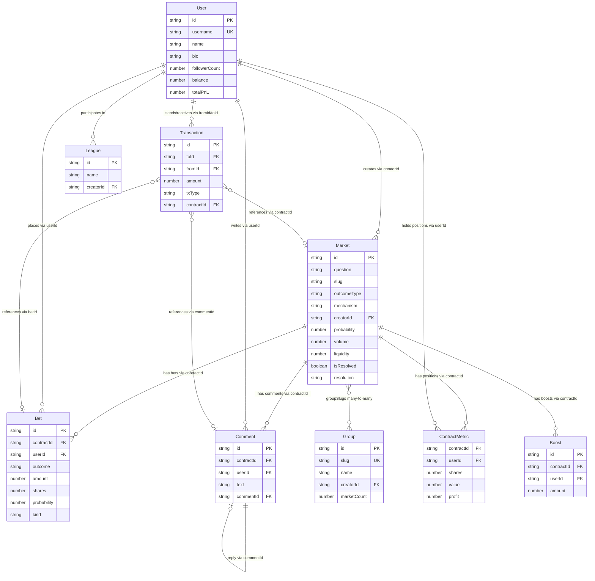

# Entity Data Model: Manifold Markets API Integration

**Purpose**: Documents the upstream Manifold Markets REST API entities that flow through this integration verbatim. Every field below is a passthrough from the upstream API — the integration performs **zero transformation** (FR-003, Q4). These are not client-defined models; they are the shapes the API returns.

**Specs**: [spec.md](./spec.md) · [plan.md](./plan.md) · [research.md](./research.md)

---

## Terminology Mapping

The Manifold ecosystem uses different names for the same concepts across layers:

| API field/site term | Internal code name | Plugin docs |
|---|---|---|
| "question" | "contract" | Market |
| "topic" | Group | Group |
| "txn" | Transaction | Transaction |
| `contractId` | `contractId` | `marketId` (in tool names) |

---

## Entity: Market

The core entity — a prediction question with outcomes. Known internally at Manifold as a "contract." Returned in two forms: a lightweight shape from list/search endpoints, and a full shape from single-market endpoints.

### Market Subtypes

**Outcome types** (field `outcomeType`) determine what kinds of answers and resolution mechanisms apply:

| Outcome Type | Description | Mechanism | Notes |
|---|---|---|---|
| `BINARY` | Yes/no question | `cpmm-1` | Default; single probability 0–1 |
| `FREE_RESPONSE` | Open-ended answers | `cpmm-1` | Multiple user-submitted answers |
| `MULTIPLE_CHOICE` | Multiple choice with fixed answers | `cpmm-multi-1` | Each answer has its own probability |
| `NUMERIC` | Numeric range answer | `cpmm-1` | Resolution is a number within a range |
| `PSEUDO_NUMERIC` | Numeric-like (e.g. "above X by date Y") | `cpmm-1` | Uses `p` (log-score) internally |
| `BOUNTIED_QUESTION` | Question with bounty pool | `dpm-2` | Bounty awards; `bountyLeft` tracks remaining |
| `POLL` | Simple poll (no trading) | — | No probability; binary yes/no per answer |

**Mechanisms** (field `mechanism`):

| Mechanism | Used By | Notes |
|---|---|---|
| `cpmm-1` | BINARY, FREE_RESPONSE, NUMERIC, PSEUDO_NUMERIC | Constant Product Market Maker v1 |
| `cpmm-multi-1` | MULTIPLE_CHOICE | Multi-outcome CPMM |
| `dpm-2` | BOUNTIED_QUESTION | Dynamic Parimutuel v2 |

### LiteMarket (list/search responses)

Returned by: `GET /v0/markets`, `GET /v0/search-markets`, batch endpoints.

| Field | Type | Description | Notes |
|---|---|---|---|
| `id` | `string` | Unique market identifier | UUID |
| `question` | `string` | The prediction question text | — |
| `slug` | `string` | URL-safe slug for human-readable links | Unique |
| `description` | `string` | Market description body | Empty string in lite form |
| `groupItemTitle` | `string` | Title for group/topic context | — |
| `resolution` | `string \| null` | Resolution outcome value | `null` when unresolved |
| `resolutionTime` | `number \| null` | Unix timestamp of resolution | `null` when unresolved |
| `resolutionProbability` | `number \| null` | Probability at resolution time | For PSEUDO_NUMERIC |
| `creatorId` | `string` | ID of the user who created the market | FK → User |
| `creatorName` | `string` | Display name of creator | Denormalized |
| `creatorUsername` | `string` | Username of creator | Denormalized |
| `creatorAvatarUrl` | `string` | Avatar URL of creator | Denormalized |
| `createdTime` | `number` | Unix timestamp of creation | — |
| `lastUpdatedTime` | `number` | Unix timestamp of last update | — |
| `closeTime` | `number \| null` | When trading closes (unix ms) | `null` = never closes |
| `bountyLeft` | `number \| null` | Remaining bounty pool | Only for BOUNTIED_QUESTION |
| `liquidity` | `number` | Current liquidity (M$) | — |
| `volume` | `number` | Total trading volume (M$) | — |
| `volume24Hours` | `number` | Volume in last 24 hours | — |
| `probability` | `number` | Current probability (0–1) | For BINARY; `NaN` for non-binary |
| `outcomeType` | `string` | One of: `BINARY`, `FREE_RESPONSE`, `MULTIPLE_CHOICE`, `NUMERIC`, `PSEUDO_NUMERIC`, `BOUNTIED_QUESTION`, `POLL` | — |
| `mechanism` | `string` | One of: `cpmm-1`, `cpmm-multi-1`, `dpm-2` | — |
| `groupSlugs` | `string[]` | Slugs of groups/topics this market belongs to | FK → Group (by slug) |
| `isResolved` | `boolean` | Whether the market has been resolved | — |
| `visibility` | `string` | Only `public` markets exposed (FR-004) | — |
| `p` | `number` | Internal log-score for PSEUDO_NUMERIC | Used only by PSEUDO_NUMERIC |
| `answers` | `Answer[]` | Always empty array in lite form | Populated in full form |
| `contracts` | `Contract[]` | Always empty array in lite form | Populated in full form |
| `position` | `number \| undefined` | Authenticated user's position | Only when authed |

### FullMarket (extends LiteMarket)

Returned by: `GET /v0/market/[id]`, `GET /v0/slug/[slug]`. Contains all LiteMarket fields plus:

| Field | Type | Description | Notes |
|---|---|---|---|
| `description` | `string` | Full markdown description of the market | Non-empty (vs. empty in lite) |
| `answers` | `Answer[]` | Array of answers (for FREE_RESPONSE, MULTIPLE_CHOICE, POLL) | Empty for BINARY/NUMERIC |
| `contracts` | `Contract[]` | Sub-contracts / answer data | — |
| `prizeAmount` | `number` | Prize pool amount (M$) | — |
| `coverImageUrl` | `string` | Cover image for the market | — |
| `featuredOnHome` | `boolean` | Whether featured on Manifold homepage | — |
| `position` | `number \| undefined` | Authenticated user's shares in the market | Only when authed |
| `hasSuspiciousBets` | `boolean` | Anti-fraud flag | — |

### Answer (embedded in FullMarket)

| Field | Type | Description | Notes |
|---|---|---|---|
| `id` | `string` | Answer identifier | — |
| `text` | `string` | Answer text | — |
| `probability` | `number` | Current probability (0–1) | For MULTIPLE_CHOICE |
| `resolution` | `string \| null` | Whether this answer won | — |
| `userId` | `string \| null` | Who submitted the answer | — |

### Market State Transitions

```
Created (open)
  │
  ├─ closeTime reached or manual close
  ▼
Closed (trading halted, pending resolution)
  │
  ├─ Creator/admin resolves
  ▼
Resolved (resolution = final outcome, isResolved = true)
```

- **Open** → `isResolved: false`, `closeTime: null` or future, `resolution: null`
- **Closed** → `isResolved: false`, `closeTime` in the past, `resolution: null`
- **Resolved** → `isResolved: true`, `resolution` set to outcome value, `resolutionTime` set

### Relationships

| Relationship | Target Entity | Via Field | Direction |
|---|---|---|---|
| Creator | User | `creatorId` | Market → User |
| Bets | Bet | `contractId` on Bet | Market ← Bet |
| Comments | Comment | `contractId` on Comment | Market ← Comment |
| Groups/Topics | Group | `groupSlugs` on Market | Market → Group (many-to-many) |
| Positions | ContractMetric | `contractId` on ContractMetric | Market ← ContractMetric |
| Leaderboard | Bet | filtered by `contractId` | Market ← Bet |

---

## Entity: User

A Manifold Markets user/trader. Returned in two forms: a full profile and a display-only lite variant.

### Full User

Returned by: `GET /v0/user/[username]`, `GET /v0/user/by-id/[id]`, `GET /v0/me` (authenticated).

| Field | Type | Description | Notes |
|---|---|---|---|
| `id` | `string` | Unique user identifier | UUID |
| `username` | `string` | Unique login handle | URL-safe |
| `name` | `string` | Display name | — |
| `avatarUrl` | `string` | Profile picture URL | — |
| `bio` | `string \| null` | User biography / about text | — |
| `bannerUrl` | `string \| null` | Profile banner image | — |
| `website` | `string \| null` | Personal website URL | — |
| `twitterHandle` | `string \| null` | Twitter/X handle | — |
| `discordHandle` | `string \| null` | Discord handle | — |
| `bannedStatus` | `string \| null` | Ban status | — |
| `createdTime` | `number` | Account creation timestamp (unix ms) | — |
| `lastBetTime` | `number \| null` | Timestamp of most recent bet | — |
| `followerCount` | `number` | Number of followers | — |
| `followingCount` | `number` | Number of users followed | — |
| `balance` | `number` | Current M$ balance | Only on `/me` or authenticated |
| `spiceBalance` | `number` | Spice balance | Only on `/me` or authenticated |
| `totalPnL` | `number` | Total profit/loss (M$) | — |
| `totalPnLShares` | `number` | Total PnL from shares | — |
| `spicePaymeWinnings` | `number` | Spice payment winnings | — |
| `currentBettingStreak` | `number \| null` | Current daily betting streak | — |

### DisplayUser (lite)

Returned by: `GET /v0/user/[username]/lite`, `GET /v0/user/by-id/[id]/lite`.

| Field | Type | Description | Notes |
|---|---|---|---|
| `id` | `string` | Unique user identifier | — |
| `username` | `string` | Unique login handle | — |
| `name` | `string` | Display name | — |
| `avatarUrl` | `string` | Profile picture URL | — |
| `bio` | `string \| null` | Bio text | — |
| `createdTime` | `number` | Account creation timestamp | — |
| `followerCount` | `number` | Number of followers | — |
| `followingCount` | `number` | Number of users followed | — |

### Relationships

| Relationship | Target Entity | Via Field | Direction |
|---|---|---|---|
| Bets placed | Bet | `userId` on Bet | User → Bet |
| Comments made | Comment | `userId` on Comment | User → Comment |
| Transactions | Transaction | `toId`/`fromId` on Transaction | User ↔ Transaction |
| Portfolio | PortfolioMetrics | `userId` query param | User → PortfolioMetrics |
| Contract positions | ContractMetric | `userId` query param | User → ContractMetric |
| Leagues | League | `userId` in standings | User → League |
| Created markets | Market | `creatorId` on Market | User → Market |

---

## Entity: Bet

A wager on a market outcome. Supports standard bets and limit orders. Returned by `GET /v0/bets` and embedded in `GET /v0/market/[id]/positions`.

| Field | Type | Description | Notes |
|---|---|---|---|
| `id` | `string` | Unique bet identifier | UUID |
| `contractId` | `string` | Market/contract this bet is on | FK → Market |
| `userId` | `string` | User who placed the bet | FK → User |
| `answerId` | `string \| null` | Specific answer (MULTIPLE_CHOICE/FREE_RESPONSE) | `null` for BINARY |
| `outcome` | `string` | Bet direction: `"YES"`, `"NO"`, or answer ID | — |
| `amount` | `number` | Amount wagered (M$) | Negative = selling shares |
| `shares` | `number` | Number of shares bought/sold | — |
| `probability` | `number` | Market probability at time of bet (0–1) | — |
| `payout` | `number \| null` | Payout received on resolution | `null` until resolved |
| `payoutNote` | `string \| null` | Note about payout | — |
| `createdTime` | `number` | Timestamp when bet was placed (unix ms) | — |
| `isCancelled` | `boolean` | Whether this bet was cancelled | — |
| `isRedemption` | `boolean` | Whether this is a share redemption | — |
| `chanceAfter` | `number \| null` | User's position probability after bet | — |
| `chanceBefore` | `number \| null` | User's position probability before bet | — |
| `limitProb` | `number \| null` | Target probability for limit order | Non-null = limit order |
| `orderAmount` | `number \| null` | Total order amount for limit orders | — |
| `fills` | `BetFill[] \| null` | Fill records for limit orders | Non-null for limit orders |
| `isFilled` | `boolean \| null` | Whether limit order is fully filled | — |
| `remainingShares` | `number \| null` | Remaining unfilled shares | — |
| `kind` | `string` | Bet kind: `"BET"` or `"LIMIT"` | — |
| `profit` | `number \| null` | Realized profit from this bet | — |

### BetFill (embedded in Bet)

Records partial fills for limit orders.

| Field | Type | Description | Notes |
|---|---|---|---|
| `amount` | `number` | Amount filled in this fill | — |
| `shares` | `number` | Shares filled in this fill | — |
| `timestamp` | `number` | When this fill occurred | — |
| `betId` | `string` | The counterparty bet ID | — |
| `userAvatarUrl` | `string` | Counterparty avatar (denormalized) | — |
| `userName` | `string` | Counterparty name (denormalized) | — |
| `userUsername` | `string` | Counterparty username (denormalized) | — |

### Limit Order Lifecycle

```
Place limit order (kind: "LIMIT", limitProb set)
  │
  ├─ Partially filled (fills array populates, isFilled: false)
  ├─ Fully filled (isFilled: true, remainingShares: 0)
  ├─ Cancelled via POST /v0/bet/cancel/[id]
  │
  ▼
Terminal: filled, partially-filled-then-expired, or cancelled
```

### Bet Filtering Parameters

Bets are filterable via query params on `GET /v0/bets`:

| Filter | Type | Notes |
|---|---|---|
| `userId` | `string` | Filter by bettor |
| `contractId` | `string` | Filter by market |
| `answerId` | `string` | Filter by answer |
| `before` | `number` | Cursor: createdTime before this |
| `after` | `number` | Timestamp lower bound |
| `limit` | `number` | Max results |
| `kind` | `string` | Filter by bet kind |
| `amount` | `number` | Filter by minimum amount |
| `redemption` | `boolean` | Filter by redemption status |

### Relationships

| Relationship | Target Entity | Via Field | Direction |
|---|---|---|---|
| Market | Market | `contractId` | Bet → Market |
| Bettor | User | `userId` | Bet → User |
| Answer | (Market.Answer) | `answerId` | Bet → Answer |

---

## Entity: Comment

A message posted on a market by a user. Posting incurs an M$1 transaction fee (FR-013, HANDOFF §3 Caveats).

| Field | Type | Description | Notes |
|---|---|---|---|
| `id` | `string` | Unique comment identifier | UUID |
| `contractId` | `string` | Market this comment is on | FK → Market |
| `userId` | `string` | Author of the comment | FK → User |
| `commentId` | `string \| null` | Parent comment ID for replies | `null` for top-level |
| `text` | `string` | Comment body (markdown) | — |
| `createdTime` | `number` | Timestamp when posted (unix ms) | — |
| `userAvatarUrl` | `string` | Author's avatar URL (denormalized) | — |
| `userName` | `string` | Author's display name (denormalized) | — |
| `userUsername` | `string` | Author's username (denormalized) | — |

### Relationships

| Relationship | Target Entity | Via Field | Direction |
|---|---|---|---|
| Market | Market | `contractId` | Comment → Market |
| Author | User | `userId` | Comment → User |
| Parent reply | Comment | `commentId` | Comment → Comment (self-ref) |

---

## Entity: Group

A collection of related markets. Called "topic" on the Manifold website.

| Field | Type | Description | Notes |
|---|---|---|---|
| `id` | `string` | Unique group identifier | UUID |
| `slug` | `string` | URL-safe slug | Unique |
| `name` | `string` | Display name of the group/topic | — |
| `description` | `string \| null` | Group description | — |
| `creatorId` | `string` | User who created the group | FK → User |
| `creatorName` | `string` | Creator's display name (denormalized) | — |
| `creatorAvatarUrl` | `string` | Creator's avatar (denormalized) | — |
| `createdTime` | `number` | Creation timestamp (unix ms) | — |
| `mostRecentContractAddedTime` | `number \| null` | When a market was last added | — |
| `marketCount` | `number` | Number of markets in this group | — |
| `totalMemberShares` | `number` | Sum of member shares across markets | — |
| `pinnedMarketIds` | `string[]` | IDs of pinned markets | — |
| `additionalSlugs` | `string[]` | Alternative slugs | — |
| `coverImageUrl` | `string \| null` | Cover image URL | — |
| `iconUrl` | `string \| null` | Group icon URL | — |
| `bannerUrl` | `string \| null` | Banner image URL | — |

### Relationships

| Relationship | Target Entity | Via Field | Direction |
|---|---|---|---|
| Markets | Market | `groupSlugs` on Market | Group ← Market (many-to-many) |
| Creator | User | `creatorId` | Group → User |

---

## Entity: Transaction

A record of mana (M$) movement — bets, payouts, transfers, fees. Requires authentication to read (`GET /v0/txns`).

| Field | Type | Description | Notes |
|---|---|---|---|
| `id` | `string` | Unique transaction identifier | UUID |
| `createdAt` | `number` | Timestamp (unix ms) | — |
| `toId` | `string \| null` | Recipient user ID | FK → User |
| `fromId` | `string \| null` | Sender user ID | FK → User |
| `toType` | `string` | Recipient type: `"USER"`, `"CHARITY"`, etc. | — |
| `fromType` | `string` | Sender type | — |
| `amount` | `number` | Amount transferred (M$) | Positive = received |
| `token` | `string` | Currency token: `"M$"`, `"SPICE"`, etc. | — |
| `txType` | `string` | Transaction type (see below) | — |
| `description` | `string` | Human-readable description | — |
| `data` | `object \| null` | Additional transaction metadata | Shape varies by txType |
| `contractId` | `string \| null` | Related market (if applicable) | FK → Market |
| `betId` | `string \| null` | Related bet (if applicable) | FK → Bet |
| `commentId` | `string \| null` | Related comment (if applicable) | FK → Comment |

### Transaction Types (txType)

Common values include: `bet`, `betPayout`, `betSubsidy`, `bonus`, `charityPayIn`, `createMarket`, `managram`, `transfer`, `tip`, `loansPayment`, `pollPayIn`, `betCancel`, `addBounty`, `awardBounty`.

### Relationships

| Relationship | Target Entity | Via Field | Direction |
|---|---|---|---|
| Recipient | User | `toId` | Transaction → User |
| Sender | User | `fromId` | Transaction → User |
| Market | Market | `contractId` | Transaction → Market |
| Bet | Bet | `betId` | Transaction → Bet |
| Comment | Comment | `commentId` | Transaction → Comment |

---

## Entity: PortfolioMetrics

Portfolio performance data for an authenticated user. Two variants: live (current snapshot) and historical (time series).

### LivePortfolioMetrics

Returned by: `GET /v0/get-user-portfolio`.

| Field | Type | Description | Notes |
|---|---|---|---|
| `totalBalance` | `number` | Total portfolio value (M$) | Cash + shares |
| `totalInvested` | `number` | Total amount invested (M$) | — |
| `totalCash` | `number` | Cash balance portion | — |
| `totalSharesValue` | `number` | Current value of all shares | — |
| `profit` | `number` | Total profit/loss (M$) | — |
| `numPositions` | `number` | Number of markets with positions | — |
| `lastBetTime` | `number \| null` | Most recent bet timestamp | — |
| `dailyProfit` | `number` | Profit in last 24 hours | — |
| `weeklyProfit` | `number` | Profit in last 7 days | — |
| `monthlyProfit` | `number` | Profit in last 30 days | — |
| `loans` | `number` | Outstanding loan amount | — |
| `resolvedProfit` | `number` | Profit from resolved markets | — |

### PortfolioMetrics (historical)

Returned by: `GET /v0/get-user-portfolio-history`. Contains the same metric fields as live but structured as time-series data points for charting.

### Relationships

| Relationship | Target Entity | Via Field | Direction |
|---|---|---|---|
| User | User | query param (implicit) | PortfolioMetrics → User |

---

## Entity: ContractMetric

Per-user, per-market position data. Returned by `GET /v0/get-user-contract-metrics-with-contracts`, which also embeds the market data for each metric.

| Field | Type | Description | Notes |
|---|---|---|---|
| `contractId` | `string` | Market identifier | FK → Market |
| `userId` | `string` | User identifier | FK → User |
| `fromkeesBalance` | `number` | Balance from kees | — |
| `shares` | `number` | Number of shares held | Per answer for multi-choice |
| `potentialShares` | `number` | Potential shares from limit orders | — |
| `totalShares` | `number` | Total shares (current + potential) | — |
| `totalSharesIfResolvedYes` | `number` | Projected shares if market resolves YES | — |
| `totalSharesIfResolvedNo` | `number` | Projected shares if market resolves NO | — |
| `value` | `number` | Current value of position (M$) | — |
| `payout` | `number \| null` | Payout if resolved | — |
| `profit` | `number` | Realized + unrealized profit | — |
| `valueCapped` | `boolean` | Whether value is capped | — |
| `contract` | `FullMarket` | Embedded market data | From the joined endpoint |

### Relationships

| Relationship | Target Entity | Via Field | Direction |
|---|---|---|---|
| Market | Market | `contractId` (+ embedded `contract`) | ContractMetric → Market |
| User | User | `userId` | ContractMetric → User |

---

## Entity: League

Competitive leaderboard grouping users by trading performance over a period.

| Field | Type | Description | Notes |
|---|---|---|---|
| `id` | `string` | Unique league identifier | UUID |
| `name` | `string` | League display name | — |
| `creatorId` | `string` | Creator of the league | FK → User |
| `creatorName` | `string` | Creator's display name (denormalized) | — |
| `creatorAvatarUrl` | `string` | Creator's avatar (denormalized) | — |
| `topTraders` | `LeagueTrader[]` | Ranked list of traders in this league | — |
| `startPeriod` | `number` | Period start timestamp | — |
| `endPeriod` | `number` | Period end timestamp | — |
| `position` | `number` | Current user's position (if authed) | — |

### LeagueTrader (embedded in League)

| Field | Type | Description | Notes |
|---|---|---|---|
| `userId` | `string` | Trader identifier | FK → User |
| `name` | `string` | Display name | — |
| `username` | `string` | Username | — |
| `avatarUrl` | `string` | Avatar URL | — |
| `profit` | `number` | Trading profit for the period | — |
| `position` | `number` | Rank in the leaderboard | — |
| `numBets` | `number` | Number of bets placed | — |

### Relationships

| Relationship | Target Entity | Via Field | Direction |
|---|---|---|---|
| Traders | User | `topTraders[].userId` | League → User |
| Creator | User | `creatorId` | League → User |

---

## Entity: Boost

A promotion record for a market. The boost history endpoint returns the public log of boosts.

| Field | Type | Description | Notes |
|---|---|---|---|
| `id` | `string` | Unique boost identifier | UUID |
| `contractId` | `string` | Market that was boosted | FK → Market |
| `userId` | `string` | User who purchased the boost | FK → User |
| `amount` | `number` | Boost amount (M$) | — |
| `createdTime` | `number` | When the boost was purchased (unix ms) | — |
| `boostedTime` | `number \| null` | When the boost was applied | — |
| `spendTime` | `number \| null` | When the boost was spent/used | — |

### Relationships

| Relationship | Target Entity | Via Field | Direction |
|---|---|---|---|
| Market | Market | `contractId` | Boost → Market |
| Purchaser | User | `userId` | Boost → User |

---

## Entity Relationships



---

## Validation Rules from Requirements

| Rule | Source | Affected Entities |
|---|---|---|
| Only `visibility: 'public'` endpoints exposed | FR-004 | Market, User (private/anonymous markets/users excluded) |
| Batch probabilities limited to 100 market IDs | FR-014 | Market (`GET /v0/market-probs`) |
| Market list paginated via `before` cursor, max 1000 | HANDOFF §3 | Market (`GET /v0/markets`) |
| Comment posting incurs M$1 fee | FR-013, HANDOFF Caveats | Comment (`POST /v0/comment`) |
| Market creation costs M$50–250 | FR-013 | Market (`POST /v0/market`) |
| All errors use uniform shape: `{category, message, status?, body?}` | FR-021 | All entities (error responses) |
| API key never logged or included in output | FR-007 | User (auth flow) |
| No response transformation — verbatim passthrough | FR-003 | All entities |
